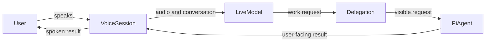

# Pi Voice context

Pi Voice adds a spoken interface to Pi without replacing Pi as the coding agent. The live model manages the conversation; Pi retains project context, tools, and responsibility for completing coding work. This language gives the [runtime architecture](./architecture.md) and [execution and type flow](./type-breakdown.md) a shared meaning, especially at the [visible delegation boundary](./architecture.md#delegating-a-coding-request).

## Model

## Language

**Voice session**:
The temporary spoken interaction that begins when the user starts `/voice`. It owns capture, playback, and the live-model connection.
_Avoid_: call, chat session

**Live model**:
The OpenAI Realtime model that receives audio, manages the spoken conversation, and asks for coding work when needed.
_Avoid_: coding agent, backend

**Pi agent**:
The Pi agent selected by the user. It receives delegated work and uses the project's normal context and tools to complete it.
_Avoid_: voice model, realtime model

**Delegation**:
A visible, structured request from the live model to the Pi agent. It contains the request and, when useful, the current spoken transcript.
_Avoid_: hidden prompt, internal message

**User-facing result**:
The safe final text returned by Pi that Pi Voice may send back to the live model for speech. Private reasoning, tool output, failed turns, and formatted or oversize content are excluded.
_Avoid_: agent transcript, model reasoning

**Capture**:
PCM audio read from the microphone and sent to the live model.
_Avoid_: recording

**Playback**:
PCM audio received from the live model and written to the speaker.
_Avoid_: audio output
