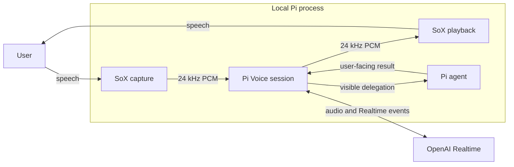
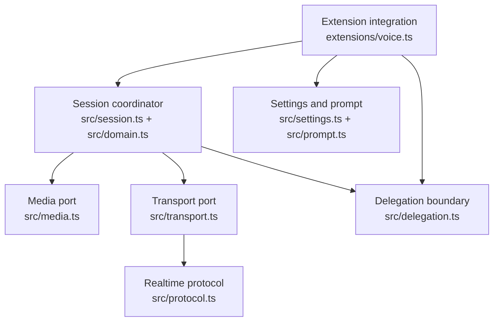
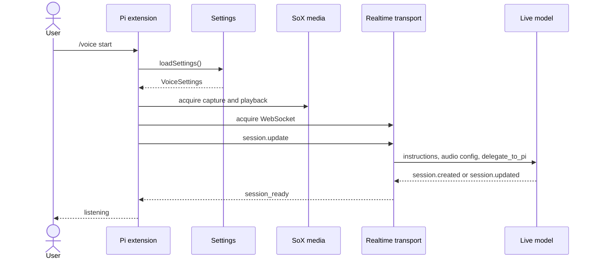
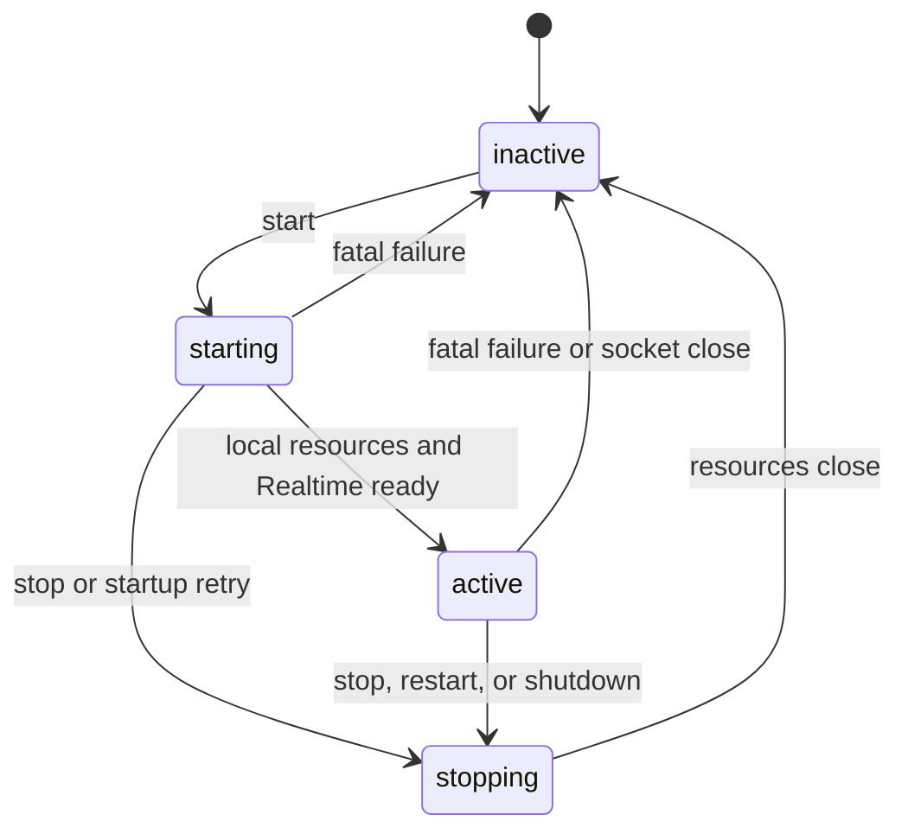

# Pi Voice architecture

Pi Voice separates low-latency conversation from coding work. The live model listens, speaks, and decides when a request needs tools. The Pi agent keeps project context, selects tools, and completes the work.

## System context



The OpenAI Realtime connection never receives Pi's private reasoning or raw tool output. Pi Voice returns only a bounded, user-facing result.

## Component boundaries



| Boundary | Owns | Does not own |
| --- | --- | --- |
| Extension integration | `/voice`, Pi events, overlays, visible messages, session lifetime | Audio framing or Realtime event parsing |
| Session coordinator | State transitions, capture and playback gates, delegation sequencing | Pi UI rendering or WebSocket details |
| Media port | Microphone frames, player writes, SoX process lifetime | Speech detection or conversation state |
| Transport port | WebSocket lifetime, outbound queue, typed inbound events | Pi turns or terminal UI |
| Realtime protocol | OpenAI event shapes, tool registration, audio and result messages | Network I/O |
| Delegation boundary | Visible request wrapper and safe result filter | Coding work |
| Settings and prompt | Defaults, validation, persistence, live-model instructions | API credentials |

`VoiceLoop` depends on the `Media`, `Transport`, and `Host` interfaces. Fake implementations use those same ports in deterministic tests.

## Starting a voice session



A session becomes active after local resources start and the Realtime endpoint reports a session event. A ten-second timeout closes the resources and permits one clean retry.

## Delegating a coding request

```mermaid
sequenceDiagram
  actor User
  participant Media as SoX capture
  participant Model as Live model
  participant Loop as VoiceLoop
  participant Pi as Pi agent
  participant Speaker as SoX playback

  User->>Media: speaks
  Media->>Loop: PCM frames
  Loop->>Model: input_audio_buffer.append
  Model-->>Loop: delegate_to_pi(input)
  Loop->>Pi: visible realtime_delegation
  Pi-->>Loop: user-facing result
  Loop->>Model: BACKEND result + function output
  Model-->>Loop: audio deltas
  Loop->>Speaker: PCM bytes
  Speaker-->>User: spoken result
```

The live model can answer a self-contained spoken question without delegation. Requests that need files, commands, lookups, or tools cross the visible delegation boundary.

Pi Voice ignores duplicate handoff identifiers. It also ties queued speech to an input generation, so a result from an older spoken turn cannot play after typed input supersedes that turn.

## Session state



The lifecycle has four phases. Muted and typing are flags within `starting` or `active`, not separate phases.

| Condition | Presented state | Capture | Playback |
| --- | --- | --- | --- |
| `phase === "starting"` | connecting | Enabled unless muted | Gated until active |
| Active and `microphoneMuted` | muted | Disabled | Allowed when the latest input was voice |
| Active and `speakerSuppressed` | typing | Enabled unless muted | Disabled |
| Active without either flag | listening | Enabled | Allowed when the latest input was voice |
| `phase === "stopping"` | stopping | Disabled | Disabled |

A failure resets the lifecycle to `inactive` and stores a message for the host to report.

## Data and trust boundaries

- Pi Voice reads `OPENAI_API_KEY` from the process environment. It redacts the value inside the Effect runtime and never writes it to settings.
- `~/.config/pi-voice/settings.json` contains preferences only. The settings writer refuses credential-bearing, malformed, or symbolic-link files.
- Microphone audio and conversation text cross the OpenAI Realtime boundary.
- Delegations enter the Pi transcript as visible `pi-voice.delegation` messages.
- Pi results return to the live model only when `speakableFinalText()` accepts them. Empty text, private analysis, private commentary, and results over the token limit are not spoken.
- A deliberate stop can flush unfinished user speech as a final delegation. A restart abandons unfinished speech to avoid creating an unintended Pi turn.

## Constraints

- Realtime PCM uses signed mono 16-bit audio at 24 kHz.
- SoX keeps audio local until Pi Voice sends microphone frames to OpenAI.
- SoX does not provide acoustic echo cancellation. Headphones prevent speaker-to-microphone feedback.
- OpenAI Realtime usage and Pi coding turns use separate providers and billing paths.
- Pi Voice supports the native Pi TUI and pins its compatible Pi version.
